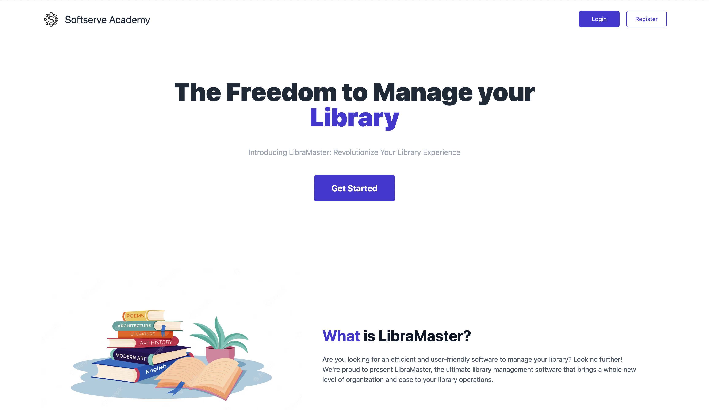

    
# LibraMaster 📚


Welcome to the Django Library Project! This project was conceived and developed during my studies at SoftServe Academy, as part of the coursework to gain real-world experience. Our main objective is to simplify the management of a library through a robust, intuitive, and user-friendly web application.

The project was developed in a team, however, the old GitHub repository may be removed soon by our organisation. The models were written by our mentors, and everything else was done by our team. It has been a long time, and I can now see what can be changed and improved. If there is a request, I will refactor this project.


## Screenshots

Hero page



Registration form


List of users


Book's detail page


Author's detail page


List of orders


# Stack 🧰

[](https://www.python.org/downloads/release/python-390/) 

[](https://docs.djangoproject.com/en/4.2/releases/4.1/)

[](https://www.django-rest-framework.org/)

[](https://django-tailwind.readthedocs.io/en/latest/installation.html)

## Installation

### Database

Setup postgres (v. 14) server.

Create database


### Project

Navigate to .env_example file directory
#### Then create .env file from template and fill in your credentials:
```bash
cp .env_example .env
```


#### Create and activate virtual enviroment

```bash
virtualenv venv
```

For MacOS
```bash
source venv/bin/activate
```
For Windows
```bash
venv\Scripts\activate
```

#### Then install requirement project's packages

```bash
pip install -r requirements.txt
```

## Run Project

#### Go to the folder with manage.py file and run the following commands


```bash
python manage.py makemigrations 
```
```bash
python manage.py migrate 
```
```bash
python manage.py createsuperuser 
```
```bash
python manage.py runserver 
```

## Contacts
Email - ihorprotsak@gmail.com

Telegram - @the_coffin_is_my_new_room